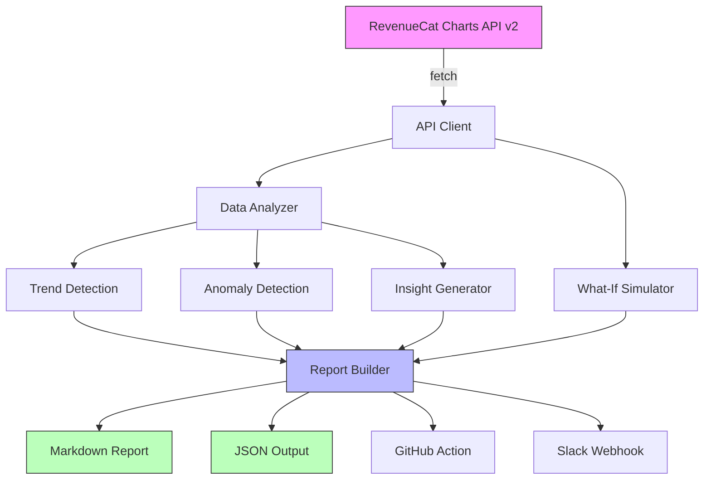

# RC Copilot

[](https://typescriptlang.org)
[](package.json)
[](LICENSE)
[](https://nodejs.org)

**Autonomous AI agent that analyzes RevenueCat subscription data and generates actionable insights.**

RC Copilot connects to the RevenueCat Charts API, analyzes your subscription metrics (MRR, churn, trials, revenue, cohorts), detects anomalies, and produces beautiful markdown reports with recommendations — all without any external AI dependency.

## Features

- **Full Subscription Analysis** — Revenue, MRR, ARR, churn, trials, conversion rates, refund rates
- **Anomaly Detection** — Statistical outlier detection (2+ standard deviations) across all metrics
- **Trend Analysis** — Identifies upward, downward, or stable trends in every metric
- **What-If Simulator** — Model churn reduction, trial conversion improvement, and customer growth scenarios
- **Rule-Based Insights** — Smart recommendations based on industry benchmarks (no LLM required)
- **Beautiful Markdown Reports** — Structured reports with tables, sections, and executive summaries
- **GitHub Action** — Schedule weekly reports, post to Slack, create issues automatically
- **Zero Production Dependencies** — Uses native `fetch` and built-in Node.js APIs only

## Architecture



## Quick Start

### CLI

```bash
# Full analysis with markdown report
npx tsx src/cli.ts analyze --api-key sk_xxx --period 90d --format markdown

# Quick metrics overview
npx tsx src/cli.ts overview --api-key sk_xxx

# What-if scenario simulation
npx tsx src/cli.ts what-if --api-key sk_xxx --reduce-churn 2%
```

### GitHub Action

```yaml
name: Weekly Subscription Report

on:
  schedule:
    - cron: '0 9 * * 1'  # Every Monday at 9am
  workflow_dispatch:

jobs:
  report:
    runs-on: ubuntu-latest
    steps:
      - uses: actions/checkout@v4
      - uses: major-rc/rc-copilot@v1
        with:
          api-key: ${{ secrets.REVENUECAT_API_KEY }}
          period: 90d
```

### Programmatic

```typescript
import { RevenueCatAPI, analyze, generateReport, runAllScenarios } from 'rc-copilot';

const api = new RevenueCatAPI('sk_xxx');
const project = await api.discoverProject();
const charts = await api.fetchCharts(CORE_CHARTS, {
  startDate: '2025-12-01',
  endDate: '2026-03-01',
  resolution: 'week',
});

const analysis = analyze(project.name, charts, startDate, endDate);
const scenarios = runAllScenarios(simulatorInput);
const report = generateReport(analysis, scenarios);
console.log(report.markdown);
```

## CLI Reference

```
USAGE:
  rc-copilot <command> [options]

COMMANDS:
  analyze     Full subscription analysis with insights and recommendations
  overview    Quick metrics overview
  what-if     Run what-if scenario simulations

OPTIONS:
  --api-key <key>          RevenueCat API key (or set REVENUECAT_API_KEY env var)
  --period <period>        Analysis period: 7d, 14d, 28d, 30d, 60d, 90d, 180d, 365d
  --format <format>        Output format: markdown, json
  --verbose                Show debug output

WHAT-IF OPTIONS:
  --reduce-churn <pct>     Simulate churn reduction (e.g., 2%)
  --improve-trials <pct>   Simulate trial conversion improvement (e.g., 50%)
  --grow-customers <mult>  Simulate customer growth (e.g., 2x)
```

## Sample Output

See a real analysis of the [Dark Noise](https://darknoise.app) app: **[examples/dark-noise-analysis.md](examples/dark-noise-analysis.md)**

### Report Sections

| Section | Description |
|---------|-------------|
| Executive Summary | Top 3-5 findings with severity indicators |
| Key Metrics | Current values, trends, and industry benchmarks |
| Anomalies Detected | Statistical outliers ranked by significance |
| Insights & Recommendations | Actionable advice based on data patterns |
| What-If Scenarios | Revenue impact projections for improvement levers |

## Charts Analyzed

RC Copilot fetches and analyzes these RevenueCat chart types:

| Chart | What it measures |
|-------|-----------------|
| `revenue` | Total revenue over time |
| `mrr` | Monthly Recurring Revenue |
| `arr` | Annual Recurring Revenue |
| `churn` | Subscription churn rate |
| `actives` | Active subscription count |
| `trials` | Active trial count |
| `trial_conversion_rate` | Trial-to-paid conversion |
| `conversion_to_paying` | Visitor-to-paying conversion |
| `customers_new` | New customer acquisitions |
| `refund_rate` | Refund rate percentage |

## How It Works

1. **Discovery** — Auto-discovers your project from the API key
2. **Data Collection** — Fetches 10 core chart types with rate limiting and retry logic
3. **Analysis** — Detects trends, anomalies (>2σ from mean), and seasonal patterns
4. **Insight Generation** — Rule-based engine compares metrics against industry benchmarks
5. **Simulation** — Projects revenue impact of churn, trial, and growth improvements
6. **Report** — Generates structured markdown or JSON output

## Tech Stack

- **TypeScript** with strict mode
- **Zero production dependencies** — native `fetch`, built-in Node.js APIs
- **Dev dependencies only:** `tsx` (runtime), `typescript` (compiler), `vitest` (testing)

## Development

```bash
# Install dev dependencies
npm install

# Type check
npm run typecheck

# Run directly
npx tsx src/cli.ts analyze --api-key sk_xxx

# Build
npm run build
```

## License

[MIT](LICENSE)
